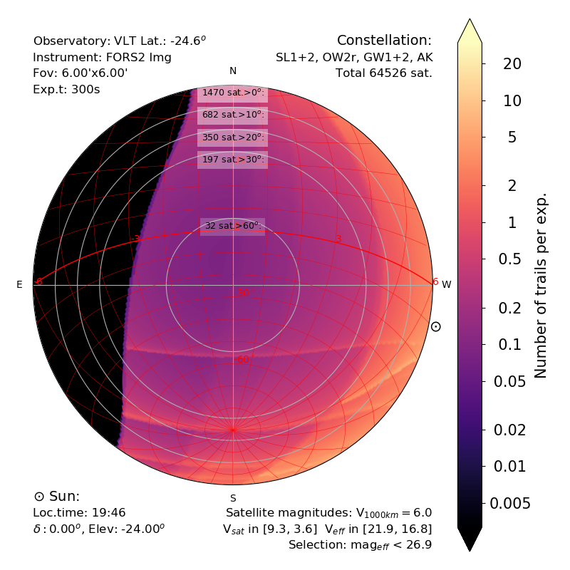

# SatConAnalytic

## Info

This package provides analytic simulations of satellite mega-constellations (Starlink, OneWeb...), to evaluate their effects on astronomical observations. Instead of computing the position of each individual satellite, the constellation is considered as a density function, which can be treated analytically. This method is infinitely faster, and is rigorous.

The method is described in our paper "Analytical simulations of the effect of satellite constellations on optical and near-infrared observations," Bassa, Hainaut, Galadí-Enríquez (2022) A&A 657, A75, [ADS 2022A&A...657A..75B](https://ui.adsabs.harvard.edu/abs/2022A%26A...657A..75B/abstract) [DOI 10.1051/0004-6361/202142101](https://ui.adsabs.harvard.edu/link_gateway/2022A&A...657A..75B/doi:10.1051/0004-6361/202142101).

A generic introduction to the issue of satellite constellations and their impact on astronomical observations is available on my [web](https://www.eso.org/~ohainaut/satellites).

The simulators are also available as [web-tools](https://www.eso.org/~ohainaut/satellites/simulators.html).
## Usage

### ObsPlot

Generates a contamination map-of-the-sky for a given observatory at a given time.

```
obsplot -d deltasun -a alphasun -e elevsun -l latitude*
    -C constellation: YESTURDAY TODAY SL2OW2 SLOW2 OW2r OW2 SLOWr(def)
    -T FlyEye WFI VST EFOSC FORSimg LSST HAWKI MICADO
       FORSspec UVES1h 4MOST ESPRESSO
       VISIR 
       skyMag TrailDens SatDens(def)
          These pre-load default 
                extptime, FoVl, FoVw, maglim, magbloom, trailf, 
                telname, instrName, latitude
    -t exptime* -f Fovl* -m maglim* -k trailf* -r resolution*
              maglim: those with eff.mag fainter are not observable
                      those brigher create a trail
              trailf: fraction of the exposure that is destroyed by trail. 1=full
              magbloom: for those brighter, trailf=1=full
    -s telName* -i instrName*
                (*: overwrites presets)
    -S do not shade low elev
    -L do not label the plot
    -B no scalebar
    -M BRIGHT FAINT ALL OBS EFFECT
         All sats, restrict to bright/faint (wrt magbloom), convert into effect on obs.
```



This is a map of the sky above the observatory (in this case, the VLT). The color scale shows the number of satellite trails crossing the observation (in this case, a 300s image with a field of 6arcmin). The grey circles are at 10, 20, and 30deg of elevation. The red grid is the right ascension (hour angle) and declination. 

The black area marks the part of the sky where all satellites are in the earth shadow (hence invisible). The horizontal (east-west) bands mark the "edge" of the sub constellations.

obsPlot can also generate maps of the satellite density (sat/sq.deg), and map of data losses.


### ObjPlot

Generates a contamination calendar for an astronomical object.

```
objplot 
    -r RA -d dec -n name
    -T FlyEye WFI VST EFOSC FORSimg LSST HAWKI MICADO
       FORSspec UVES1h 4MOST ESPRESSO
       VISIR 
       skyMag TrailDensity SatDensity(def)
          These pre-load default 
                extptime, FoVl, FoVw, maglim, magbloom, trailf, 
                telname, instrName, latitude
    -l latitude*
    -t exptime* -f Fovl* -m magbloom* -k trailf* 
              maglim: those with eff.mag fainter are not observable
                      those brigher create a trail
              trailf: fraction of the exposure that is destroyed by trail. 1=full
              magbloom: for those brighter, trailf=1=full
    -s telName* -i instrName*
                (*: overwrites presets)
    -S do not shade low elev
    -L do not label the plot
    -M BRIGHT FAINT ALL OBS EFFECT
         All sats, restrict to bright/faint (wrt magbloom), convert into effect on obs.
```


For a given object (here RA=266 Dec=-48) seen from a given observatory (here VLT),
the calendar give the visibility of the object. Each horizontal line corresponds to a date (left scale), each column to a local time -midnight is at the centre.

Blue indicates the sun is up, observations are not possible. The blue lines mark the different twilights; observations are normally performed between the -18 lines.

Grey indicates that the object is below the horizon, observations are not possible. The green diagonals mark times when the object is at equal elevation (indicated in degrees).

Black indicates that the object is in a region of the sky where all satellites are in the shadow of the Earth.

Colors give the fraction of observations that would be lost, or the density of satellites (various options).


## Files

The code is far from elegant, as I was learning Python on-the-fly... Please be compassionately forgiving. 

- conan.py	main functions for ConAn
- conanplot.py	plotting functions for ConAn
- constants.py	generic constants for ConAn
- constellations.py	definition of the constellations for ConAn

- obsplot.py	main interface to plot the sky over an observatory
- objplot.py	main interface to plot an object's calendar

## Other implementation

Another implementation of our analytical simulations is available at [Cees Bassa's](https://github.com/cbassa/satconsim) . 
