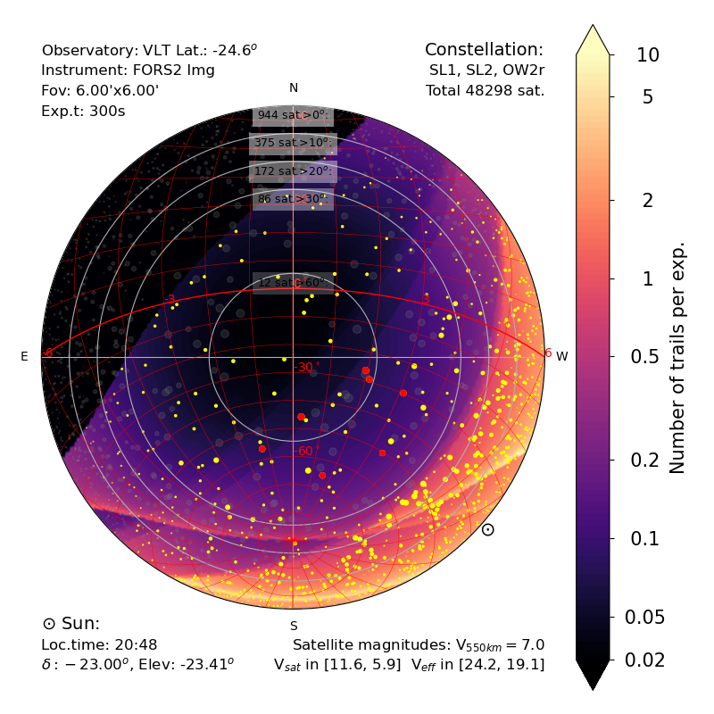
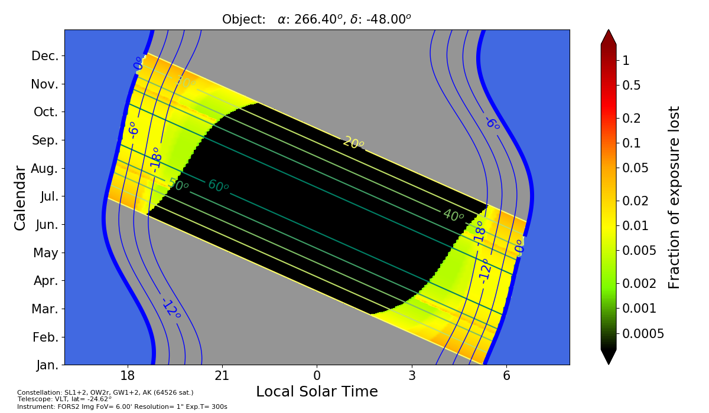
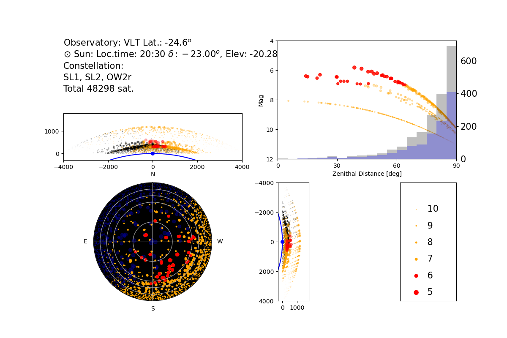

# SatConAnalytic

## Info

This package provides analytic simulations of satellite mega-constellations (Starlink, OneWeb...), to evaluate their effects on astronomical observations. Instead of computing the position of each individual satellite, the constellation is considered as a density function, which can be treated analytically. This method is infinitely faster, and is rigorous.

The method is described in our paper "Analytical simulations of the effect of satellite constellations on optical and near-infrared observations," Bassa, Hainaut, Galadí-Enríquez (2022) A&A 657, A75, [ADS 2022A&A...657A..75B](https://ui.adsabs.harvard.edu/abs/2022A%26A...657A..75B/abstract) [DOI 10.1051/0004-6361/202142101](https://ui.adsabs.harvard.edu/link_gateway/2022A&A...657A..75B/doi:10.1051/0004-6361/202142101).

A generic introduction to the issue of satellite constellations and their impact on astronomical observations is available on my [web](https://www.eso.org/~ohainaut/satellites).

The simulators are also available as [web-tools](https://www.eso.org/~ohainaut/satellites/simulators.html).

Jump to section [Script Usage](#Script-Usage) Script Usage for the simulator scripts.

## Library

conan.py is the main simulation library. The main function is modelOneConstMag. It returns the parameters for Eq.1 in [Bassa+22](https://ui.adsabs.harvard.edu/link_gateway/2022A&A...657A..75B/doi:10.1051/0004-6361/202142101), eg to compute $\rho_{\rm sat}$ and $\sigma_{\rm sat}$ for deriving $N_{\rm trails}$:

$N_{\rm trail} = \rho_{\rm sat} \times A_{\rm FoV} + \sigma_{\rm sat} \times t_{\rm exp} \times L_{\rm FoV}$

where 
- $N_{\rm trails}$ is the number of trails in the Field of View,
- $\rho_{\rm sat}$ is the density of satellites [N/sq.deg]
- $A_{\rm FoV}$ is the area of the field [sq.deg]
- $\sigma_{\rm sat} = \rho_{\rm sat} \times \omega_{\rm sat}$
  - $\sigma_{\rm sat}$ is the trail density [N/deg/s]
  - $\omega_{\rm sat}$ the angular velocity of the satellites [deg/s]
- $t_{\rm  exp}$ the exposure time [s]
- $L_{\rm FoV}$ the diametre (or lenght) of the FoV.

The firs term corresponds to the number of satellites present instantenously in the field, 
the second term corresponds to the number of trails entering the field of view during the exposure.

modelOneConstMag also returns the approx magnitude of the satellites present at Az,El, using a very simple model.


``` 
modelOneConstMag(AzEl,lat, 
                 sunAlpha,sunDelts,
                 inc,alt,num ):
    Model one shell over a set of Az,El pointings
    IN
    - AzEl: array [ array of Azimuths, array of Elevations] on which the
      constellation shall be evaluated. Both in [deg]
    - lat: latitude of the observer [deg]
    - sunAlpha, sunDelts: HourAngle and Declination of the Sun [deg]
    - inc, alt, num: parameters of the satellite constellation shell:
      - inc: inclination [deg]
      - alt: altitude [km]
      - num: number of satellites in the shell
    OUT
    - satellite number density (same shape as AzEl)
    - satellite apparent angular velocity (same shape as AzEl)
    - magnitude of the satellite
            np.reshape(wdensityi,  (AzEl.shape[1],AzEl.shape[2]) ) ,\
        np.reshape(wAngularVel, (AzEl.shape[1],AzEl.shape[2]) ),\
        mag
```


conanplot.py has a series of functions used for the plots in the two high-level applications obsplot and objplot.

## Setup files

### Constellations

constellation.py reads a json file and returns it as a list of Constellation objects.

constellation.json has a list of pre-defined constellations, as follows:

```
SL1old :         "Starlink Gen-1 (old)"  10627 sat, 8 shells
SL1 :    "Starlink Gen-1 SAT-MOD-20200417-00037"         11926 sat, 8 shells
SL2 :    "Starlink Gen-2"        30000 sat, 8 shells
ESP :    "ESPACE Rwanda"         337323 sat, 28 shells
OW2o :   "OneWeb-2 (original)"   47844 sat, 3 shells
OW2r :   "OneWeb-2 (reduced 2021)"       6372 sat, 3 shells
GW :     "Guo Wang (China) GW-A59 -2"    12992 sat, 7 shells
AK :     "Amazon Kuiper"         3236 sat, 3 shells
GS :     "Galaxy Space  Yinhe"   1000 sat, 1 shells
HWS :    "HanWha systems"        2000 sat, 1 shells
LGC :    "Lynk Global cell"      2000 sat, 1 shells
YESTURDAY :  "Today"s pre-constellation satellites (2020)"   2725 sat, 3 shells
TODAYconst :     "Starlink and ONEWEB 2022-APR"  1763 sat, 2 shells
```

Run constellations.py for a detailed list.

Some meta-constellations are available in obsplot and objplot, for convenience:
- SL = SL1 + SL2
- OW = OW2r
- SLOW = SL1 + SL2 + OW2r
- TODAY = YESTURDAY + TODAYconst
- SLOWGWAK = YESTURDAY, SL1, SL2, OW2r, GW, AK 
- ALL = YESTURDAY, SL1, SL2, OW2r, GW, AK, ESP


### Telescopes and Instruments

telescopes.py will read a json file defining the telescope and instrument parameters and return a list of Telescope objects.

The JSON must have the following structure


```
    {
        "code" : "FORSimg",           # a code name to identify the instrument. Default ""
        "telescope"   : "VLT",        # name of the telescope (for label). Default ""
        "lat"         : -24.62,       # latitude of the observatory [deg]. Default -24.62
        "instrument"  : "FORS2 Img",  # name of the instrument (for label). Default ""
        "expt"        : 300.0,        # exposure time [s]. Default 1.0s
        "fovl_arcsec"        : 360.0, # length of the FoV [arcsec]. Default 1.0"
        "fovw_arcsec"        : 360.0, # width the FoV [arcsec]. Default fovl_arcec
        "resol_arcsec"       : 1.0,   # resolution (seeing or pixel) [arcsec]. Default 1.0"
        "maglim"      : 25.2,         # limiting magnitude (for expt). Default 99.
        "magbloom"    : 18.5,         # dramatic saturation magnitude. Default -99
        "trail_arcsec"      : 5.0     # width of a satellite trail [arcsec]. Default 5."
    }
```

All (but code) can be ommitted; the default values will be used.

Alternative attributes can be defined:
```
        "fovl"        : length of the FoV [deg]. Default  0.00027778 (1arcsec)
        "fovw"        : width the FoV [deg]. Default fovl
        "resol"       : resolution (seeing or pixel) [deg]. Default  0.00027778 (1arcsec)
        "trailf"      : width of the trail relative to fovl. Default trail_arcsec/fovl_arcsec
```

The telescopes.json file contains definition for:
```
WFI:            MPE/ESO 2.2m WFI
VST:            VST OmegaCam
EFOSC:          NTT EFOSC2 imaging
FORSimg:        VLT FORS2 Imaging
HAWKI:          VLT HAWKI
MICADO:         ELT MICADO
FORSspec:       VLT FORS2 Spec
UVES:           VLT UVES
XSHOOTER:       VLT X-SHOOTER
UVES1h:         VLT UVES
4MOST:          VISTA 4MOST LowResolution
4MOSTH:         VISTA 4MOST HighResolution
LAMOST:         LAMOST MRS
MOONS-LR:       VLT MOONS-LR
MOONS-HR:       VLT MOONS-LR
ESPRESSO:       VLT ESPRESSO
VISIR:          VLT VISIR thermal imaging
VISIR1:         VLT VISIR
ELTHrm:         ELT HARMONY
ELTMetImg:      ELT METIS Imaging
ELTMetLng:      ELT METIS Long Slit
ELTMicImg:      ELT MICADO Imaging
ELTMicLng:      ELT MICADO Long Slit 
FlyEye:         ESA FlyEye  
LSST:           VRO LSST
Cat703:         0.7m Catalina CCD
CatG96:         1.52m Catalina CCD
ZTF:            1.2m Oschin ZTF 
Binoc:          Binocular 10x70 from Brussels
Photo:          Photographic Camera from Brussels
ALMA:           ALMA beam
```

## Script Usage

This package comes with 2 ready-to-use scripts. They can use pre-defined instruments or define the instrument with command line parameters.

### obsSky


Plot satellite density over the map of the sky.

Alternatively, the plot can show
- velocity density of the satellites
- the number of satellites / detectable satellites / saturating satellites / 
  non-saturating satellites in the field of view of an instrument
- the effect of the satellites on the observations (%loss)
- the sky brighness increase caused by satellites.

The script can optionally plot a realization of the satellites (using satDot, see below), for illustration.

```
options:
  -h, --help            show this help message and exit

  Position of the sun:
  -d DELTASUN, --deltaSun DELTASUN
                        Sun: Declination of the Sun [deg]
  -a ALPHASUN, --alphaSun ALPHASUN
                        Sun: Hour Angle of the Sun [deg]. If present, overwrites
                        elevSun
  -e ELEVSUN, --elevSun ELEVSUN
                        Sun: Elevation of the Sun BELOW the horizon. Should
                        probably be >0 in most cases [deg]
  If both ALPHASUN and ELEVSUN are given, ELEVSUN will be used.

  Constellation:
  -C CONSTELLATIONS, --constellations CONSTELLATIONS
                        ID of the constellation group.
   See above for a list of constellations included in constellations.json


  -l LAT, --lat LAT     Observatory: Latitude of the observatory [deg]
  -r RESOL, --resol RESOL
                        Observatory: Resolution of the instrument [deg]
  -t EXPT, --expt EXPT  Observatory: Exposure time [sec]
  -f FOVL, --fovl FOVL  Observatory: Field of view of the instrument. Length or
                        diametre [arcsec]
  -w FOVW, --fovw FOVW  Observatory: Field of view of the instrument. Width. Equal
                        to Length if omitted [arcsec]
  -m MAGLIM, --maglim MAGLIM
                        Observatory: Detection limit magnitude of the instrument
                        [5sigma Mag during expTime]
  --magbloom MAGBLOOM   Observatory: Magnitude over which the instrument saturates
                        [Mag for expTime]. Default: -99 (no blooming)
  -k TRAILF, --trailf TRAILF
                        Observatory: Trail filling fraction (width of the trail as
                        fraction of FoV)
  -s TELESCOPE, --telescope TELESCOPE
                        Observatory: Name of the telescope
  -i INSTRUMENT, --instrument INSTRUMENT
                        Observatory: Name of the instrument
  -T CODE, --code CODE  Observatory: Predefined telescope/instrument with
                        extptime, FoVl, FoVw, maglim, magbloom, trailf, telescope,
                        instrument, resolution, latitude. Use individual options
                        to overwrite presets. 
  -M MODE, --mode MODE  Plot: ALL (Default), OBS, BRIGHT, FAINT, or EFFECT

                        Plot the number of trails per exposure:
                            ALL: all illuminated satellites, including those too faint to be detected
                            OBS: all detected satellites (use this for most cases)
                            BRIGHT: only the satellites causing catastrophic saturation
                        EFFECT: plot the fraction of data lost (assuming that 
                            the pixel under a trail are lost, and the whole frame
                            is lost in case of catastrophic saturation)

  --noplot              Plot: Don't generate the plot (mostly debug)
  --noshade             Plot: Don't shade low elevations
  --noscalebar          Plot: Don't include scalebar
  --noalmuc             Plot: Don't write sat count on the almucantars
  --nolabel             Plot: Don't label the plot
  --pdf                 Plot: output file in pdf (default is png)
```




This is a map of the sky above the observatory (in this case, the VLT). The color scale shows the number of satellite trails crossing the observation (in this case, a 300s image with a field of 6arcmin). The grey circles are at 10, 20, and 30deg of elevation. The red grid is the right ascension (hour angle) and declination. 

The black area marks the part of the sky where all satellites are in the earth shadow (hence invisible). The horizontal (east-west) bands mark the "edge" of the sub constellations.

In this example, a realization of the satellite position is overplotted (the size of the dot represent the satellite's magnitude. Red dots are brighter than 7).

obsSky can also generate maps of the satellite density (sat/sq.deg), and map of data losses.


### objectCalendar

Generates a contamination calendar for an astronomical object.

```
objectCalendar 
  -h, --help            show this help message and exit
  -a RA, --RA RA        Right Ascension of the object[deg]
  -d DEC, --DEC DEC     Declination of the object[deg]
  -n OBJLABEL, --objlabel OBJLABEL
                        Name of the object for label
  -C CONSTELLATION, --constellation CONSTELLATION
                        Constellation code (or meta-code) - see above for list

  -T CODE, --code CODE  Observatory: Telescope/Instrument code - see above for list

  -l LAT, --lat LAT     Observatory: Latitude of the observatory [deg] (OVERWRITE
                        preset)
  -t EXPT, --expt EXPT  Observatory: Individual exposure time [s] (OVERWRITE
                        preset)
  -r RESOL, --resol RESOL
                        Observatory: Resolution element (seeing, pixel) [deg]
                        (OVERWRITE preset)
  -f FOVL, --fovl FOVL  Observatory: Length of the field-of-view [deg] (OVERWRITE
                        preset)
  -w FOVW, --fovw FOVW  Width of the field-of-view [deg] (Default=Fovl; OVERWRITE
                        preset)
  -k TRAILF, --trailf TRAILF
                        Observatory: Fraction of the exposure destroyed by a trail
                        (1=full) (OVERWRITE preset)
  -m MAGLIM, --maglim MAGLIM
                        Observatory: Limiting magnitude [mag] (detection limit for
                        expTime) (OVERWRITE preset)
  -M MAGBLOOM, --magbloom MAGBLOOM
                        Observatory: Saturation magnitude [mag]. Brighter object
                        destroy the full exposure: their trailf=1 (OVERWRITE
                        preset)
  --instrument INSTRUMENT
                        Observatory: Name of the instrument for label (OVERWRITE
                        preset)
  --telescope TELESCOPE
                        Observatory: Name of the telescope for label (OVERWRITE
                        preset)
  
  --mode MODE           BRIGHT FAINT ALL OBS EFFECT
                        Plot the number of trails per exposure:
                            ALL: all illuminated satellites, including those too faint to be detected
                            OBS: all detected satellites (use this for most cases)
                            BRIGHT: only the satellites causing catastrophic saturation
                        EFFECT: plot the fraction of data lost (assuming that 
                            the pixel under a trail are lost, and the whole frame
                            is lost in case of catastrophic saturation)


```




For a given object (here RA=266 Dec=-48) seen from a given observatory (here VLT),
the calendar give the visibility of the object. Each horizontal line corresponds to a date (left scale), each column to a local time -midnight is at the centre.

Blue indicates the sun is up, observations are not possible. The blue lines mark the different twilights; observations are normally performed between the -18 lines.

Grey indicates that the object is below the horizon, observations are not possible. The green diagonals mark times when the object is at equal elevation (indicated in degrees).

Black indicates that the object is in a region of the sky where all satellites are in the shadow of the Earth.

Colors give the fraction of observations that would be lost, or the density of satellites (various options).

### satDots

Discrete simulation of the satellites - this is not the analytic simulation using densities, but the vintage method where the position of each satellite is computed individually.


```
satDots.py

Compute and plot the position and magnitude of each satellite

options:
  -h, --help            show this help message and exit
  -a RA, --RA RA        local time [hour]
  -d DEC, --DEC DEC     Declination of the Sun [deg]
  -n OBJLABEL, --objlabel OBJLABEL
                        Name of the object for label
  -C CONSTELLATION, --constellation CONSTELLATION
                        Constellation code (or meta-code)
  -T CODE, --code CODE  Observatory: Telescope/Instrument code
  -l LAT, --lat LAT     Observatory: Latitude of the observatory [deg] (OVERWRITE preset)
  -t EXPT, --expt EXPT  Observatory: Individual exposure time [s] (OVERWRITE preset)
  -r RESOL, --resol RESOL
                        Observatory: Resolution element (seeing, pixel) [deg] (OVERWRITE preset)
  -f FOVL, --fovl FOVL  Observatory: Length of the field-of-view [deg] (OVERWRITE preset)
  -w FOVW, --fovw FOVW  Width of the field-of-view [deg] (Default=Fovl; OVERWRITE preset)
  -k TRAILF, --trailf TRAILF
                        Observatory: Fraction of the exposure destroyed by a trail (1=full) (OVERWRITE preset)
  -m MAGLIM, --maglim MAGLIM
                        Observatory: Limiting magnitude [mag] (detection limit for expTime) (OVERWRITE preset)
  -M MAGBLOOM, --magbloom MAGBLOOM
                        Observatory: Saturation magnitude [mag]. Brighter object destroy the full exposure: their
                        trailf=1 (OVERWRITE preset)
  --instrument INSTRUMENT
                        Observatory: Name of the instrument for label (OVERWRITE preset)
  --telescope TELESCOPE
                        Observatory: Name of the telescope for label (OVERWRITE preset)

```



Example of satDots plot: bottom left shows the sky over the observatory, with the dots of the illuminated satellites; the red ones are brighter than mag=7. On top and to the right, side views of the constellation, showing the limb of the Earth. Black dots are satellites in the shadow of the Earth. Top right shows the magnitude of the satellites as a function of their zenithal distance, for each satellite (dots) and their number as an histogram (blue: illuminated, grey: dark).

## Files

The code is far from elegant, as I am learning Python on-the-fly... Please be compassionately forgiving. 

- conan.py	main functions for ConAn
- conanplot.py	plotting functions for ConAn
- constants.py	generic constants for ConAn
- constellations.py	definition of the constellations for ConAn

- obsSky.py	main interface to plot the sky over an observatory
- objectCalendar.py	main interface to plot an object's calendar
- satDots.py: discrete simulation of the constellation.

## Other implementation

Another implementation of our analytical simulations is available at [Cees Bassa's](https://github.com/cbassa/satconsim) . 
